# Asset Production Pipeline

## Overview

The asset production pipeline for ATRIA transforms creative concepts into optimized 3D assets ready for web deployment. The pipeline emphasizes quality, performance, and compatibility across all target devices.

## Production Flow

```mermaid
graph TD
    A[Creative Concept] --> B[3D Modeling]
    B --> C[Texturing]
    C --> D[Lighting Setup]
    D --> E[Rendering]
    E --> F[Post-Processing]
    F --> G[Compression]
    G --> H[Optimization]
    H --> I[Web Deployment]
    
    style A fill:#0B0B0B,stroke:#D4D4D4
    style B fill:#0B0B0B,stroke:#D4D4D4
    style C fill:#0B0B0B,stroke:#D4D4D4
    style D fill:#0B0B,stroke:#D4D4D4
    style E fill:#0B0B0B,stroke:#D4D4D4
    style F fill:#0B0B0B,stroke:#D4D4D4
    style G fill:#0B0B,stroke:#D4D4D4
    style H fill:#0B0B0B,stroke:#D4D4D4
    style I fill:#0B0B0B,stroke:#D4D4D4
```



## Stage 1: 3D Modeling (Blender)

### Tools
- **Software**: Blender 3.6 LTS
- **Plugins**: HardOps, BoxCutter, SpeedFlow
- **Standards**: Metric units, Y-up orientation

### Process
1. **Reference Gathering**: Collect 8K reference images and LiDAR scans
2. **Base Mesh Creation**: Low-poly base with proper topology
3. **Detail Sculpting**: High-resolution sculpting for surface details
4. **Retopology**: Clean quad-based mesh for animation
5. **UV Unwrapping**: Efficient UV layout with 2048px textures

### Output
- **Format**: .blend (native)
- **Resolution**: High-poly sculpt + low-poly game-ready mesh
- **Polycount**: ≤ 50,000 faces for interactive models

## Stage 2: Texturing

### PBR Workflow
- **Base Color**: sRGB color space
- **Metallic**: Grayscale, linear space
- **Roughness**: Grayscale, linear space
- **Normal**: Tangent space, linear space
- **Height**: Grayscale displacement map
- **Ambient Occlusion**: Grayscale, linear space

### Texturing Tools
- **Substance Painter**: Primary texturing software
- **Substance Designer**: Procedural material creation
- **Photoshop**: Touch-ups and custom textures

### Resolution Standards
- **Hero Assets**: 2048×2048 px
- **Secondary Assets**: 1024×1024 px
- **UI Elements**: 512×512 px

## Stage 3: Export to USDZ

### Conversion Process
1. **Export from Blender**: glTF 2.0 export with Draco compression
2. **Validation**: Check in glTF Validator
3. **Conversion**: Use USD from glTF toolchain
4. **Optimization**: Remove unused nodes and materials

### USDZ Benefits
- **Universal Support**: iOS, macOS, Windows
- **Compression**: Built-in ZIP compression
- **Metadata**: Embedded asset information
- **Animation**: Native support for complex animations

## Stage 4: Draco Compression

### Compression Settings
- **Position**: 14-bit quantization
- **Texture Coordinates**: 12-bit quantization
- **Normals**: 10-bit octahedral encoding
- **Color**: 8-bit quantization

### Performance Gains
- **Reduction**: 60-80% file size reduction
- **Quality**: Visually lossless compression
- **Compatibility**: Native Three.js support

## Stage 5: Custom glTF Extensions

### Extension Development
1. **Transmission**: Custom transmission materials
2. **Sheen**: Advanced fabric and surface materials
3. **Clearcoat**: Multi-layer paint and coating effects
4. **Iridescence**: Thin-film interference effects

### Implementation
- **Parser**: Custom glTF extension parser
- **Shader**: GLSL shader modifications
- **Fallback**: Standard PBR materials for unsupported browsers

## Stage 6: Web Optimization

### Asset Optimization Checklist
- [ ] Meshopt compression applied
- [ ] Texture compression (ASTC/BPTC/ETC2)
- [ ] LOD generation for complex models
- [ ] Animation retargeting for web
- [ ] Metadata stripping
- [ ] File size verification

### Performance Targets
- **Hero Scene**: ≤ 2 MB compressed
- **Individual Assets**: ≤ 500 KB compressed
- **Texture Atlas**: ≤ 1 MB per atlas
- **Total Initial Load**: ≤ 4.3 MB

## Quality Assurance

### Validation Process
1. **Visual Inspection**: Compare to reference materials
2. **Technical Review**: Check polygon counts and texture resolutions
3. **Performance Testing**: Load times and frame rates
4. **Cross-Platform Testing**: Verify on all target devices

### Approval Workflow
1. **Artist Review**: Self-assessment by creator
2. **Technical Review**: QA team validation
3. **Creative Director**: Final approval
4. **Client Preview**: Stakeholder sign-off

## Asset Delivery

### Directory Structure
```
/assets/optimized/
  /hero-scene/
    liquid-glass-atrium.draco.glb
    obsidian-prism.draco.glb
    gallery-corridor.draco.glb
  /projects/
    project-01/
      diorama.draco.glb
      cinemagraph.mp4
      textures.ktx2
    ...
  /ui/
    interactive-button.draco.glb
    glass-panel.draco.glb
```

### Version Control
- **Naming**: Semantic versioning (v1.2.3)
- **Backup**: Daily snapshots to AWS S3
- **Rollback**: Quick restore within 30 days